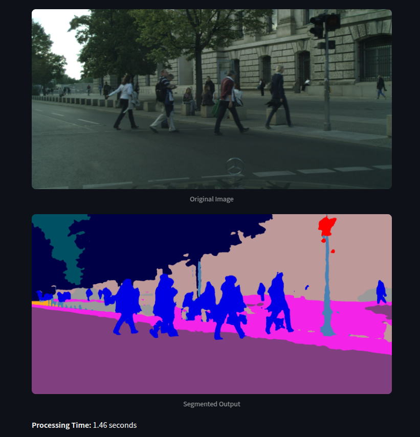

# Road Scene Segmentation for Autonomous Driving

## Project Overview

This project aims to improve road scene segmentation for autonomous vehicles by developing a high-performing deep learning model. Road scene segmentation assigns a semantic label to each pixel in a road scene (e.g., road, vehicle, pedestrian) to help autonomous systems make safe decisions in complex traffic scenarios.

  
<sub>_Demo: Semantic segmentation prediction on a validation image (placeholder — add actual image)_</sub>

## Objectives

-   **Improve Segmentation Accuracy:** Achieve high pixel-level classification accuracy (>80% mIoU) across all relevant classes, including small or distant objects.
-   **Enhance Boundary Detection:** Produce crisp object boundaries, minimizing ambiguity between adjacent regions.
-   **Optimize Computational Efficiency:** Enable real-time inference (~10–15 FPS) on standard GPU hardware.

## Methodology

We implemented and compared two advanced models:

1. **U-Net:** A symmetric encoder-decoder architecture with skip connections, effective for boundary-aware segmentation.
2. **DeepLabV3+:** Incorporates atrous convolutions and an Atrous Spatial Pyramid Pooling (ASPP) module to capture multi-scale contextual information.

### Enhancements

#### Attention Gate Mechanism

To improve segmentation in cluttered scenes and emphasize relevant features:

-   **U-Net with Attention:** Attention gates filter encoder features before skip connections, allowing the decoder to focus on spatially important regions (e.g., pedestrians, poles).
-   **DeepLabV3+ with Attention:** Integrated an attention gate in the decoder after ASPP and before combining low-level features, refining spatial alignment and segmentation of fine-grained regions.

#### Loss Function

-   We used a **hybrid loss function**: a weighted combination of **Focal Loss** and **Dice Loss** to:
    -   Address class imbalance
    -   Penalize false negatives
    -   Enhance performance on small and edge-region classes

#### Lightweight Backbone

-   For DeepLabV3+, we used **MobileNetV2** to reduce the computational footprint while maintaining reasonable accuracy.

### Training Strategy

-   Optimizer: SGD with momentum and weight decay
-   Learning Rate Scheduler: Cosine Annealing
-   Augmentations: Random scaling (1.0–1.5), horizontal flips, and cropping (512×256) to improve generalization

## Evaluation Metrics

-   **Mean Intersection-over-Union (mIoU):** Primary metric for segmentation quality
-   **Dice Coefficient:** For overlap-based evaluation
-   **Per-class IoU:** To detect class-wise underperformance
-   **Inference Speed:** Targeting 10–15 FPS on standard GPU setups

## Datasets

1. **Cityscapes:** 5,000 finely annotated urban street scenes (19 classes)
2. **KITTI:** Focused on drivable road segmentation (289 train, 290 test images)

## Setup

```bash
git clone https://github.com/poojan-kaneriya/road-scene-segmentation.git
cd road-scene-segmentation
python -m venv venv
source venv/bin/activate
pip install -r requirements.txt
```

## Training

Train the U-Net on Cityscapes:

```bash
python training/train.py --model unet --dataset cityscapes
```

Train DeepLabV3+ on KITTI:

```bash
python training/train.py --model deeplabv3_attention --dataset kitti
```

## Evaluation

```bash
python evaluation/evaluate.py --model unet --dataset cityscapes
```

## Results

-   **Expected mIoU:** > 0.80 on fine-tuned DeepLabV3+ (ResNet or MobileNet)
-   **Expected FPS:** 10–15 FPS on NVIDIA 1080 Ti / RTX 3060-class GPU

## Contributors

-   Siddharth Mehta
-   Poojan Kaneriya

## License

This project is licensed under the MIT License.
